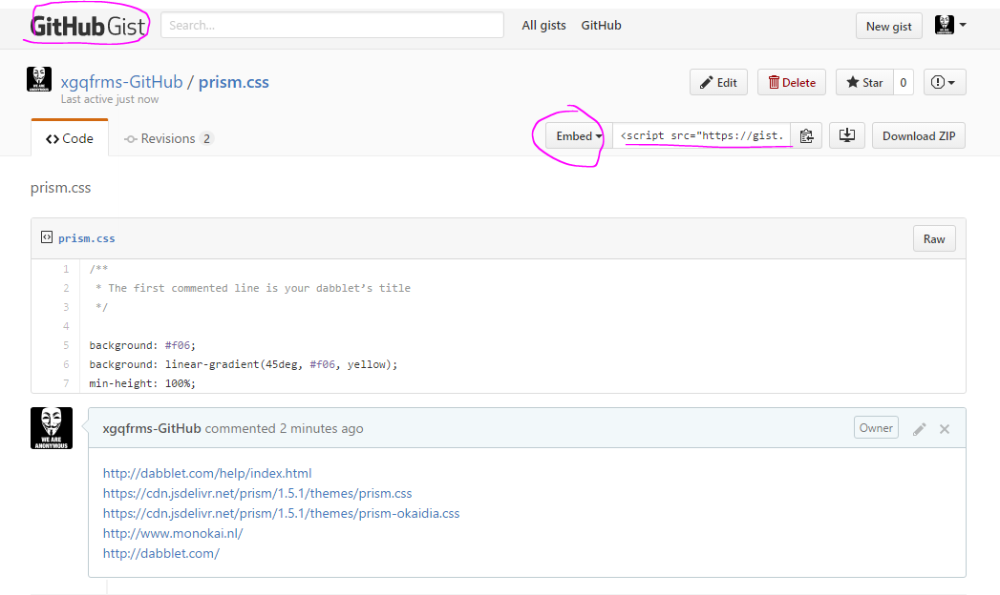

# GitHub Git (free share code) 

https://gist.github.com/xgqfrms-GitHub/


[You can save your work in **Github gists**, embed it in other websites and share it with others.](http://dabblet.com/help/index.html)  

> [prism.css](https://gist.github.com/xgqfrms-GitHub/34004905d1abb1589d04f7f6ba3c2008)  

```js
<script src="https://gist.github.com/xgqfrms-GitHub/34004905d1abb1589d04f7f6ba3c2008.js"></script>

``` 





